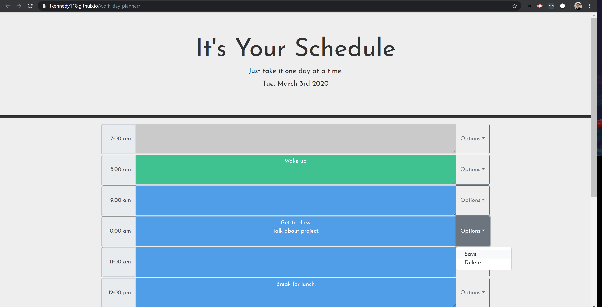

# work-day-planner

## Link to Deployed Application
[work-day-planner](https://tkennedy118.github.io/work-day-planner/)

## Description
This is a simple day planner application that allows users to save information for each hour of the day. It runs in the browser and utilizes dynamically updated HTML and CSS powered by jQuery. The application also implements the [Moment.js](https://momentjs.com/) library to gather, display, and dynamically update time information.

## Files
* index.html
* script.js
* style.css

## Screenshots
